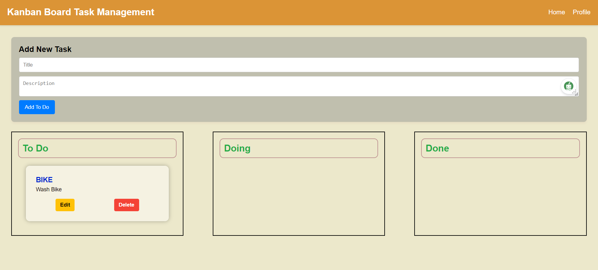

# Kanban Board App

Welcome to the Kanban Board App! This simple application empowers you to manage your tasks efficiently using the Kanban methodology. Here are the key features of the app:



## Features

### 1. Drag-and-Drop Task Management

Easily manage your tasks by dragging and dropping them between different status columns. The intuitive user interface allows you to effortlessly move tasks from To Do to Doing, and from Doing to Done.

### 2. Status Columns

Tasks are organized into three distinct status columns:

- **To Do:** List tasks that are yet to be started.
- **Doing:** Keep track of tasks that are currently in progress.
- **Done:** Showcase tasks that have been successfully completed.

### 3. Create, Edit, and Delete Tasks

- **Create:** Add new tasks to the To Do column. Each task can have a title and description.
- **Edit:** Modify task details including title and description to ensure accurate representation.
- **Delete:** Remove tasks when they are no longer relevant.

### 4. Visual Task Representation

Tasks are visually represented as cards within each status column. The cards display relevant task information, making it easy for you to quickly identify and manage your tasks.

## Technology Stack

This project is built using the MERN (MongoDB, Express.js, React, Node.js) stack.

## Screenshots


   ```
Access the application in your web browser at `https://kanban-board-app-nrly.vercel.app/`.
